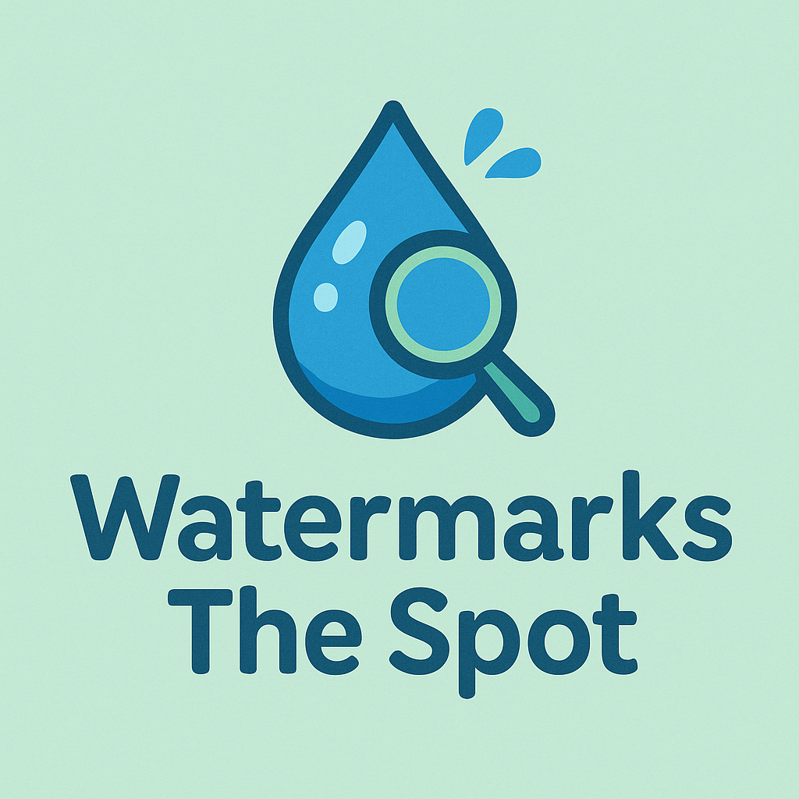

# 🌊 Watermarks The Spot

**Watermarks The Spot** is a playful desktop app built with Python that lets users upload an image, add a custom text watermark, and save the newly marked masterpiece. Perfect for quick branding, memes, or protecting your work.



---

## ✨ Features

- 📁 Upload and preview local images (PNG, JPG, GIF, etc.)
- 💬 Add custom watermark text
- 💾 Save the final watermarked image to your computer
- 🎨 Clean, colorful UI with blue-green water vibes

---

## 🚀 Getting Started

### 🔧 Prerequisites

- Python 3.6 or newer  
- Pillow (Python Imaging Library fork)

Install the Pillow library if you haven't yet:

```bash
pip install pillow

```
---
## 🧭 How to Use
	1.	Click Upload to browse and select a photo.
	2.	Enter your watermark text in the text box.
	3.	Click Submit to apply the watermark and choose where to save it.
	4.	Done — your watermarked image is ready to go! ✅